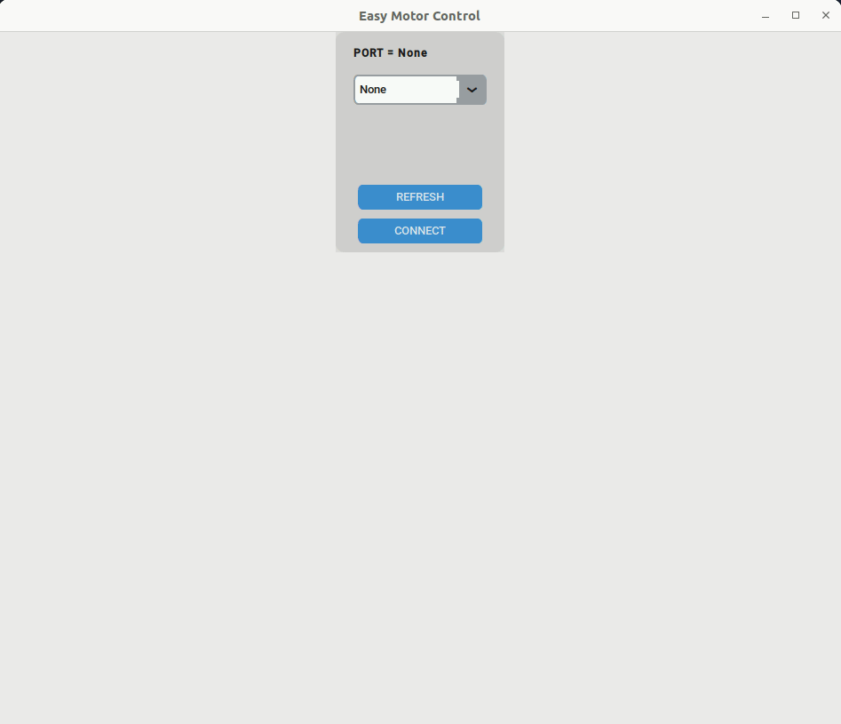

# EMC2_gui_application
This is a child project of the Easy Motor Control (EMC2) project. It contains source code of its GUI application. The application requires that you have the EMC2_driver module shield (with the [EMC2_arduino_driver_code](https://github.com/samuko-things/EMC2_arduino_driver_code) uploaded to it) connected to your PC via USB serial communication to access its full functionality. without the shield only the start page can be viewed.

### App Demo





## Run the GUI app
- Ensure you have python3 installed on your PC

- Download (by clicking on the green Code button above) or clone the repo into your PC
	> you can use this command if you want to clone the repo:
  >
	>  ```git clone https://github.com/samuko-things/EMC2_gui_application.git``` 

- Install the following python packages before you run the application
	> PySerial:
	> ```pip3 install pyserial``` 
  >
	> [CustomTkinter](https://customtkinter.tomschimansky.com/documentation/):
	>  ```pip3 install customtkinter``` 

- In the root folder run the **EMC2_gui_application.py**
	>  ```python3 EMC2_gui_application.py``` 